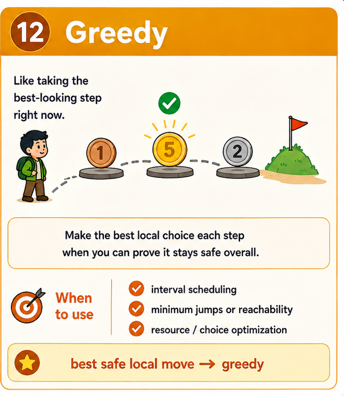

# Greedy — Pattern Refresh



> **30-second trigger:** a locally best choice can be proved safe globally

## 1. The idea in plain English

Take the best-looking safe move now and never revisit it.

**Analogy:** At each step, choose the option that gives the best immediate advantage—only when you can prove it won't hurt the final answer.

## 2. How to recognize it

Before touching the keyboard, ask:

- Can sorting reveal a natural best next choice?
- Can I prove an exchange argument: any optimal solution can use my choice?
- Is this an interval scheduling/reachability/resource allocation problem?
- Does keeping only one best-so-far state dominate worse alternatives?

If several of those are true, this pattern should be near the top of your shortlist.

## 3. Common forms of the pattern

- Interval scheduling.
- Reachability/jump problems.
- Sort + choose.
- Two-pass greedy.
- Greedy with heap.

## 4. The invariant to understand

> The chosen local decision must preserve the possibility of an optimal global solution.

This is more important than memorizing the code. If you can explain the invariant, you can usually rebuild the implementation under interview pressure.

## 5. TypeScript skeleton

```ts
values.sort((a, b) => /* useful order */);

for (const value of values) {
  if (/* safe and beneficial */) {
    // commit to this choice
  }
}
```

Treat this as a **shape**, not a solution to memorize. The important part is knowing what the state means and why it changes.

## 6. Complexity instinct

Often O(n) or O(n log n) when sorting is required.

Before submitting an exercise, say the time and space complexity out loud and explain **why**.

## 7. Common mistakes

- Calling an algorithm greedy just because it makes a local choice.
- Failing to prove why a choice is safe.
- Using greedy on coin/change problems where denominations do not support it.
- Missing the sorting criterion that makes the greedy proof work.

## 8. Recall drill — 2 minutes

Without looking above, answer these aloud:

1. Why can you commit to this choice permanently?
2. What worse choices does this decision dominate?
3. Can you construct a counterexample to your greedy rule?

## 9. Recognition sentence

Complete this before every exercise:

> **“I think this is Greedy because …”**

If you cannot finish that sentence clearly, spend another minute understanding the problem before coding.

## 10. Memory hook

> **Trigger:** best safe local move → **Greedy**

---

### Ready?

Close this file and tackle the exercise **without copying the template**.  
The goal is not to remember syntax. The goal is to recognize the pattern and rebuild it from first principles.
