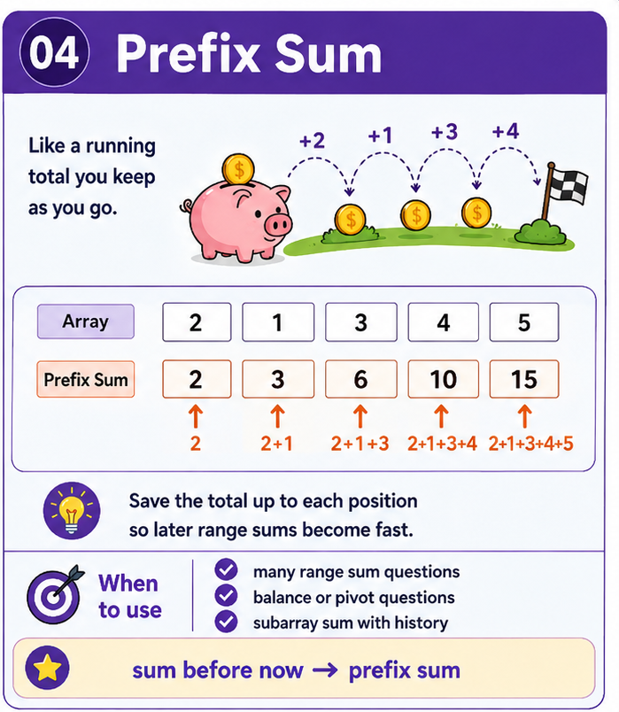

# Prefix Sum — Pattern Refresh



> **30-second trigger:** range sums, cumulative history, subarray totals, balance points

## 1. The idea in plain English

Store the total up to each position so future range questions are cheap.

**Analogy:** Keep a running bank balance; to know what changed between two dates, subtract the earlier balance from the later one.

## 2. How to recognize it

Before touching the keyboard, ask:

- Will I answer many sum queries?
- Do I repeatedly need the total before an index?
- Can a subarray sum be written as `prefix[right] - prefix[left]`?
- Does the problem ask how often a previous cumulative state occurred?

If several of those are true, this pattern should be near the top of your shortlist.

## 3. Common forms of the pattern

- 1D prefix array.
- Running prefix variable.
- Prefix sum + hash map.
- 2D prefix sum.
- Difference array for range updates.

## 4. The invariant to understand

> `prefix[i]` must have one precise meaning, such as the sum of the first `i` elements.

This is more important than memorizing the code. If you can explain the invariant, you can usually rebuild the implementation under interview pressure.

## 5. TypeScript skeleton

```ts
const prefix = new Array(values.length + 1).fill(0);

for (let i = 0; i < values.length; i++) {
  prefix[i + 1] = prefix[i] + values[i];
}

const rangeSum = (left: number, right: number) =>
  prefix[right + 1] - prefix[left];
```

Treat this as a **shape**, not a solution to memorize. The important part is knowing what the state means and why it changes.

## 6. Complexity instinct

Build in O(n); many range queries become O(1).

Before submitting an exercise, say the time and space complexity out loud and explain **why**.

## 7. Common mistakes

- Off-by-one errors in prefix indices.
- Mixing inclusive and exclusive definitions.
- Forgetting to seed prefix state with zero when counting subarrays.
- Trying Sliding Window when negative values destroy monotonicity.

## 8. Recall drill — 2 minutes

Without looking above, answer these aloud:

1. What does `prefix[i]` represent?
2. How do you recover a range from two prefix values?
3. Why is prefix + map useful for subarray counting?

## 9. Recognition sentence

Complete this before every exercise:

> **“I think this is Prefix Sum because …”**

If you cannot finish that sentence clearly, spend another minute understanding the problem before coding.

## 10. Memory hook

> **Trigger:** sum before now → **Prefix Sum**

---

### Ready?

Close this file and tackle the exercise **without copying the template**.  
The goal is not to remember syntax. The goal is to recognize the pattern and rebuild it from first principles.
