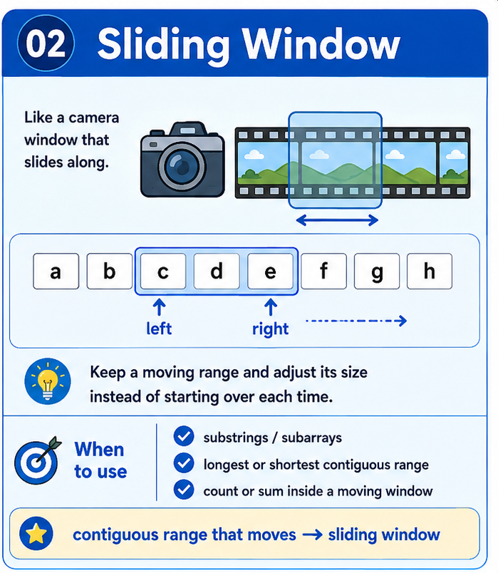

# Sliding Window — Pattern Refresh



> **30-second trigger:** contiguous substring/subarray + longest, shortest, count, or sum

## 1. The idea in plain English

Maintain one moving range instead of rebuilding every possible range from scratch.

**Analogy:** Move a camera frame across a film strip; update only what enters and leaves the frame.

## 2. How to recognize it

Before touching the keyboard, ask:

- Does the problem ask about a contiguous range?
- Can I update the current range in constant time when one item enters/leaves?
- Is there a condition that tells me when the window is valid or invalid?
- Am I looking for a longest, shortest, maximum, or minimum contiguous region?

If several of those are true, this pattern should be near the top of your shortlist.

## 3. Common forms of the pattern

- **Fixed window:** size k never changes.
- **Variable window:** expand with right, shrink with left.
- **Frequency window:** map/set tracks what is inside.
- **Monotonic deque window:** maintain best candidate inside a range.

## 4. The invariant to understand

> The window state must always describe exactly the elements between left and right.

This is more important than memorizing the code. If you can explain the invariant, you can usually rebuild the implementation under interview pressure.

## 5. TypeScript skeleton

```ts
let left = 0;

for (let right = 0; right < values.length; right++) {
  // include values[right]

  while (/* window is invalid */) {
    // remove values[left]
    left++;
  }

  // current window is valid
}
```

Treat this as a **shape**, not a solution to memorize. The important part is knowing what the state means and why it changes.

## 6. Complexity instinct

Usually O(n), because each pointer moves forward at most n times.

Before submitting an exercise, say the time and space complexity out loud and explain **why**.

## 7. Common mistakes

- Using it when the chosen elements do not need to be contiguous.
- Shrinking with `if` when the condition requires repeated shrinking.
- Forgetting to remove outgoing values from the window state.
- Confusing longest-valid-window logic with shortest-valid-window logic.

## 8. Recall drill — 2 minutes

Without looking above, answer these aloud:

1. What makes the current window valid?
2. When does right move? When does left move?
3. What state lets you update the window without rescanning it?

## 9. Recognition sentence

Complete this before every exercise:

> **“I think this is Sliding Window because …”**

If you cannot finish that sentence clearly, spend another minute understanding the problem before coding.

## 10. Memory hook

> **Trigger:** contiguous range that moves → **Sliding Window**

---

### Ready?

Close this file and tackle the exercise **without copying the template**.  
The goal is not to remember syntax. The goal is to recognize the pattern and rebuild it from first principles.
